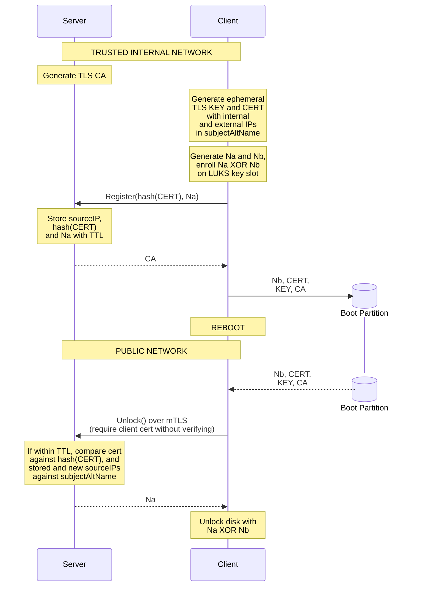

# Network Unlock: Remote LUKS disk decryption over mTLS

## Threat Model

- Internal network is trusted, nodes are not. However, a compromised network unlock server won't collude with a network attacker.
- Attacker has full access to the public network.
- Attacker has eventual access to the disk and can recover any deleted file.

Any full disk encryption unlocking scheme of a remote machine without a TPM, e.g. SSH-ing into a dropbear initramfs, is vulnerable to the same attacker: someone who can read your unencrypted /boot partition and sit on your network. Against dropbear, they extract the SSH host key from the initramfs, impersonate your server, and capture the passphrase you type.

This protocol doesn't strive to be stronger than that, it accepts the same threat model. An attacker with disk access + network access within the TTL window can steal the ephemeral TLS cert + key from /boot, connect to the server, and retrieve Na. The protocol just removes the human from the loop while being no worse than typing a password over SSH.
